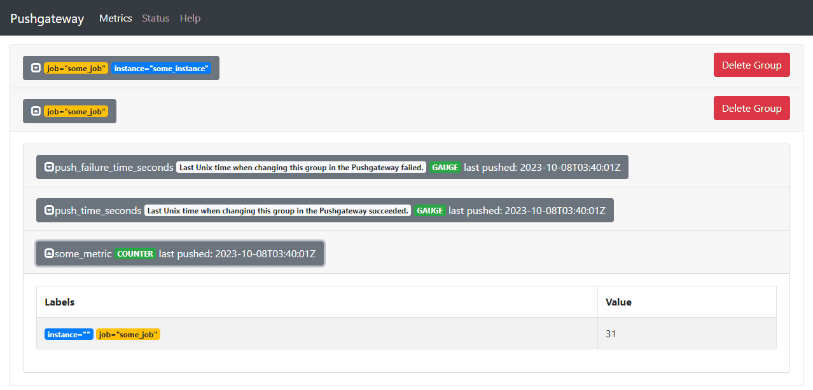
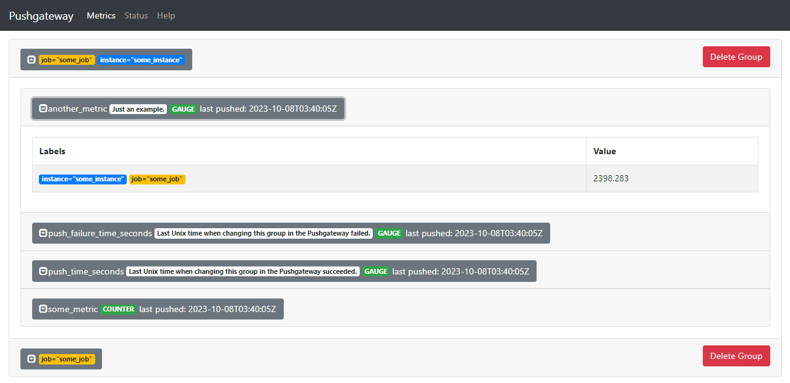
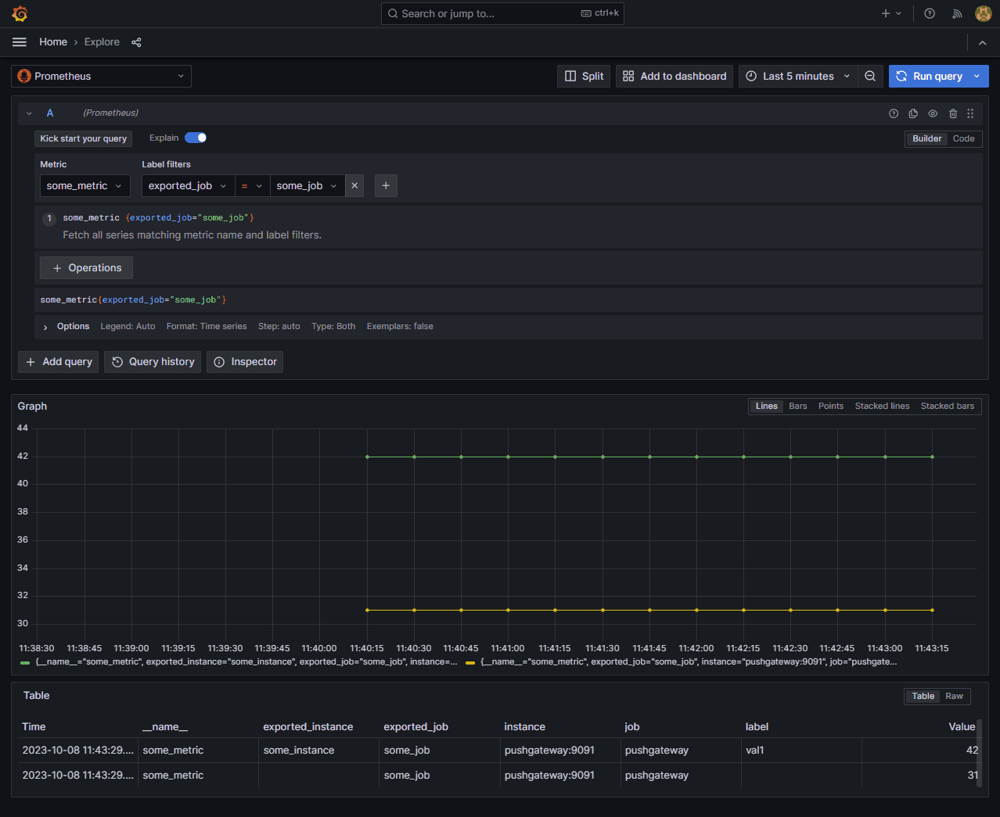
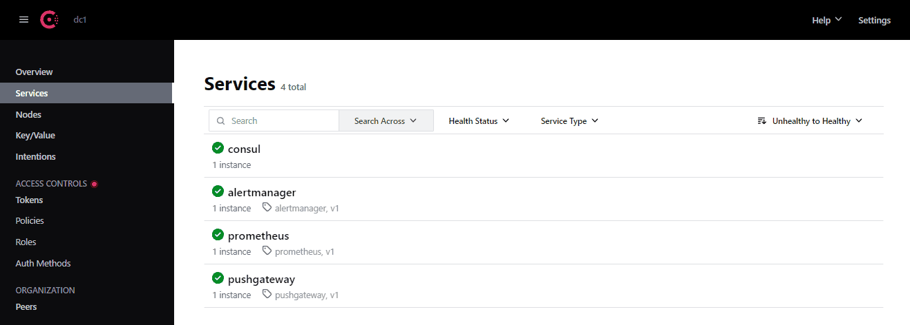

# observability-demo

## 环境

Windows + Docker Desktop + WSL

## 搭建

prometheus + pushgateway + alertmanager + grafana

```bash
docker compose up
```

部署地址
- Prometheus: http://localhost:9090
- Pushgateway: http://localhost:9091
- Alertmanager: http://localhost:9093
- Grafana: http://localhost:3000
  - username: `admin`
  - password: `grafana`
- Consul: http://localhost:8500

常用命令

```bash
# 查看容器日志
docker compose logs -f --tail=50 prometheus

# 删除网络
docker network prune

# 删除
docker compose rm

# 重启
docker compose restart

# 删除数据文件
rm -rf *_data/*
```

## 测试

### pushgateway

向 pushgateway 推送数据

```bash
cat <<EOF | curl --data-binary @- http://localhost:9091/metrics/job/some_job
# TYPE some_metric counter
some_metric 31
EOF
```

```bash
cat <<EOF | curl --data-binary @- http://localhost:9091/metrics/job/some_job/instance/some_instance
# TYPE some_metric counter
some_metric{label="val1"} 42
# TYPE another_metric gauge
# HELP another_metric Just an example.
another_metric 2398.283
EOF
```

在 pushgateway 中查看：http://localhost:9091





在 grafana 中查看：http://localhost:3000



删除推送的数据

```bash
curl -X DELETE http://localhost:9091/metrics/job/some_job
curl -X DELETE http://localhost:9091/metrics/job/some_job/instance/some_instance
```

### consul

consul API

```bash
# 注册
curl -X PUT --data @payload.json http://localhost:8500/v1/agent/service/register

# 查看
curl http://localhost:8500/v1/agent/services

# 删除
curl -X PUT http://localhost:8500/v1/agent/service/deregister/service_id
```

调用脚本注册服务

```bash
# 注册服务
./register-service.sh -r

# 删除服务
./register-service.sh -d
```

在 consul 中查看：http://localhost:8500



## 问题解决

**权限不足**

[err="open /prometheus/queries.active: permission denied" #5976](https://github.com/prometheus/prometheus/issues/5976)

```bash
prometheus  | goroutine 1 [running]:
prometheus  | github.com/prometheus/prometheus/promql.NewActiveQueryTracker({0x34f767b, 0x5}, 0x14, {0x3df5b80, 0xc000923270})
prometheus  |   /app/promql/query_logger.go:123 +0x411
prometheus  | main.main()
prometheus  |   /app/cmd/prometheus/main.go:645 +0x7812
prometheus  | ts=2023-10-07T09:13:03.295Z caller=main.go:539 level=info msg="No time or size retention was set so using the default time retention" duration=15d
prometheus  | ts=2023-10-07T09:13:03.295Z caller=main.go:583 level=info msg="Starting Prometheus Server" mode=server version="(version=2.47.1, branch=HEAD, revision=c4d1a8beff37cc004f1dc4ab9d2e73193f51aaeb)"
prometheus  | ts=2023-10-07T09:13:03.295Z caller=main.go:588 level=info build_context="(go=go1.21.1, platform=linux/amd64, user=root@4829330363be, date=20231004-10:31:16, tags=netgo,builtinassets,stringlabels)"
prometheus  | ts=2023-10-07T09:13:03.295Z caller=main.go:589 level=info host_details="(Linux 5.15.90.1-microsoft-standard-WSL2 #1 SMP Fri Jan 27 02:56:13 UTC 2023 x86_64 3f65493298e0 )"
prometheus  | ts=2023-10-07T09:13:03.295Z caller=main.go:590 level=info fd_limits="(soft=1048576, hard=1048576)"
prometheus  | ts=2023-10-07T09:13:03.295Z caller=main.go:591 level=info vm_limits="(soft=unlimited, hard=unlimited)"
prometheus  | ts=2023-10-07T09:13:03.295Z caller=query_logger.go:115 level=error component=activeQueryTracker msg="Failed to create directory for logging active queries"
prometheus  | ts=2023-10-07T09:13:03.295Z caller=query_logger.go:93 level=error component=activeQueryTracker msg="Error opening query log file" file=/prometheus/data/queries.active err="open data/queries.active: no such file or directory"
prometheus  | panic: Unable to create mmap-ed active query log
```

[New Docker Install with persistent storage, Permission problem](https://community.grafana.com/t/new-docker-install-with-persistent-storage-permission-problem/10896)

```bash
grafana  | GF_PATHS_DATA='/var/lib/grafana' is not writable.
grafana  | You may have issues with file permissions, more information here: http://docs.grafana.org/installation/docker/#migrate-to-v51-or-later
grafana  | mkdir: can't create directory '/var/lib/grafana/plugins': Permission denied
```

解决方案：修改文件夹权限

```bash
sudo chmod 777 *_data
```
