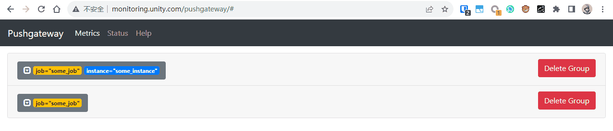
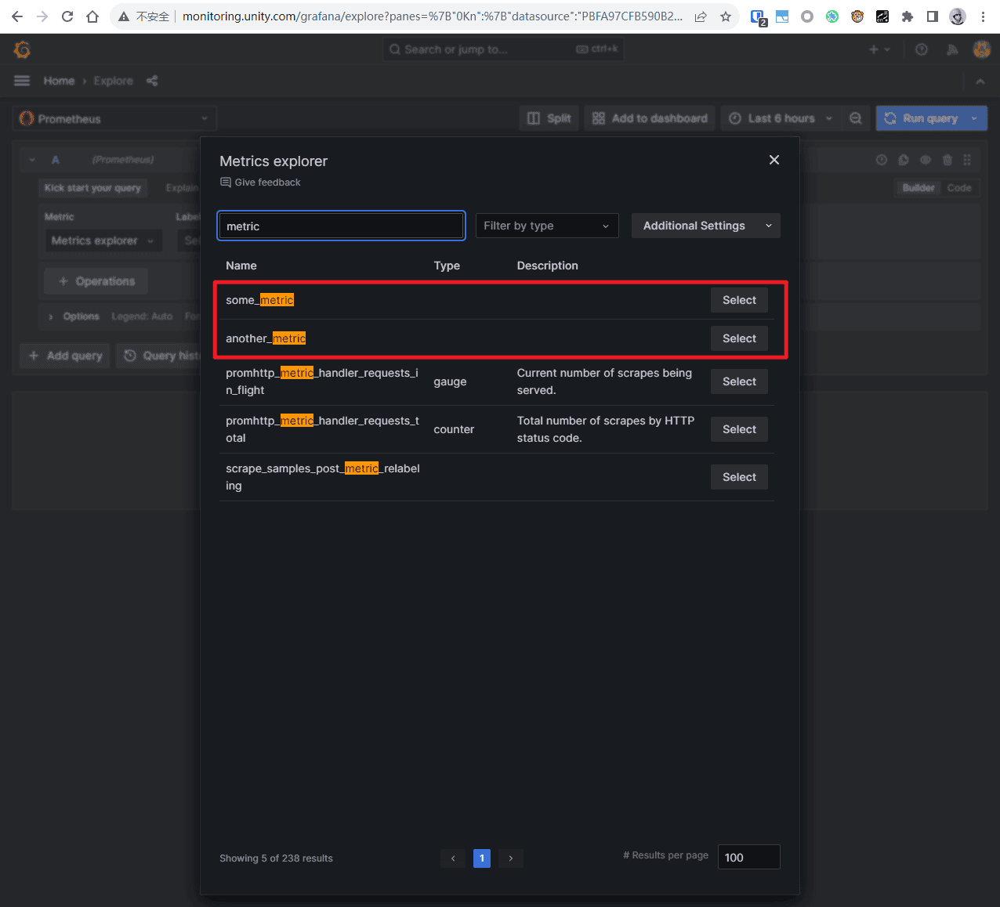
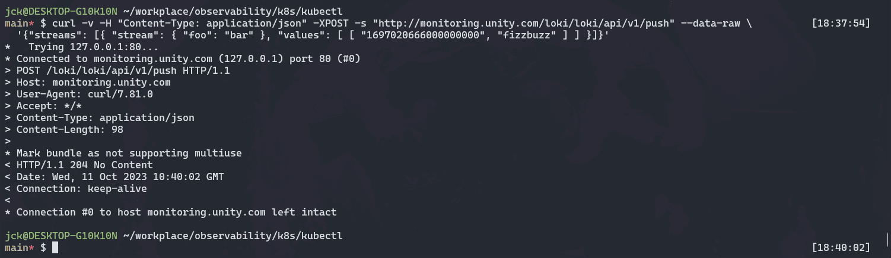
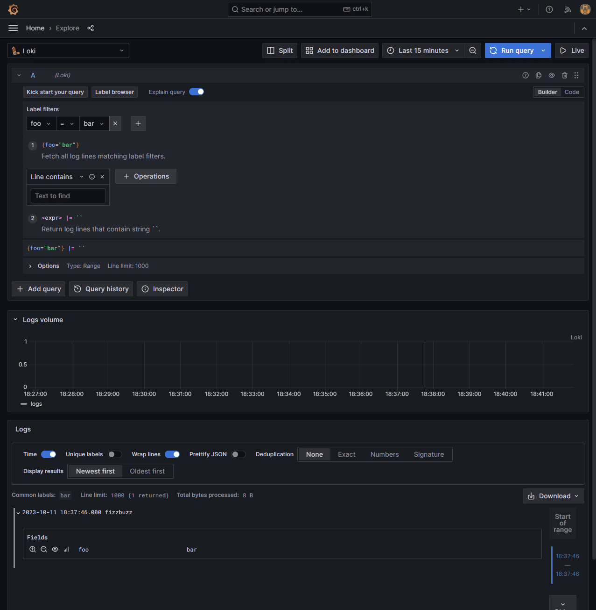
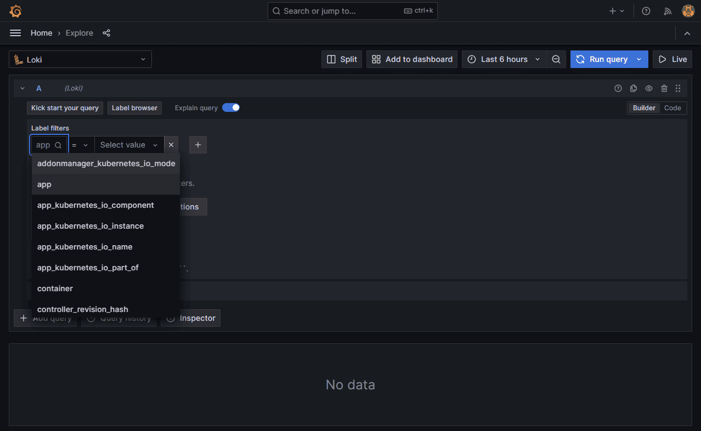
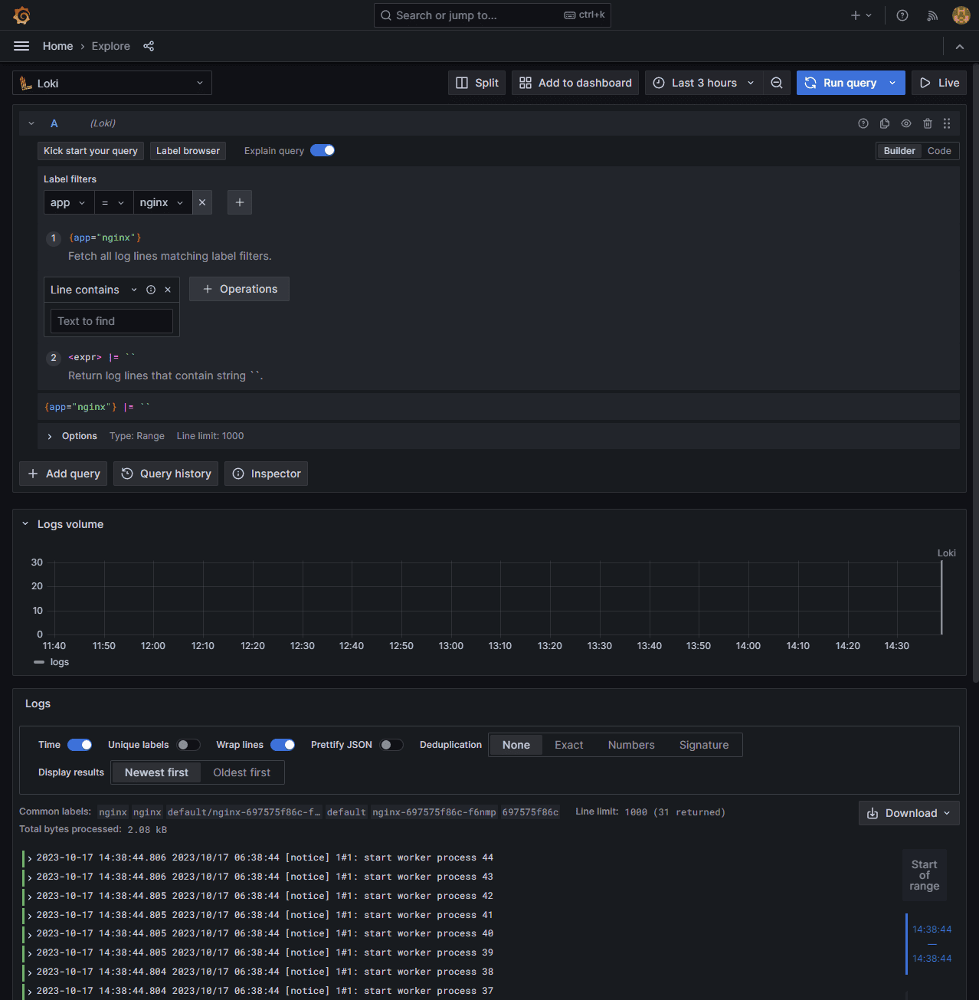

# observability-demo

## 环境

Windows + WSL + Minikube + Helm

[Set up Ingress on Minikube with the NGINX Ingress Controller | Kubernetes](https://kubernetes.io/docs/tasks/access-application-cluster/ingress-minikube/)

```bash
# addon
minikube addons enable ingress
minikube addons enable ingress-dns

# tunnel
minikube tunnel
```

## kubectl 搭建

搭建 prometheus + pushgateway + alertmanager + grafana + loki + ingress-nginx

进入 `observability-demo/k8s/kubectl` 目录

```bash
# namespace
kubectl create namespace monitoring
kubectl get namespaces

# role
kubectl create -f role.yaml
kubectl get clusterrolebindings

# pvc
kubectl create -f pvc.yaml
kubectl get pvc -n monitoring

# configmap
kubectl create -f configmap.yaml
kubectl get configmaps -n monitoring

# deployment
kubectl create -f deployment.yaml
kubectl get deployments -n monitoring
kubectl get pods -n monitoring

# service
kubectl create -f service.yaml
kubectl get services -n monitoring

# port-forward
kubectl get pods -n monitoring
kubectl port-forward grafana-68768c78b7-4spss 3000:3000 -n monitoring

# ingress
kubectl create -f ingress.yaml
kubectl get ingress -n monitoring
```

修改 hosts 文件（`/etc/hosts` 和 `C:\Windows\System32\drivers\etc\hosts`）

```
127.0.0.1 monitoring.unity.com
```

访问 http://monitoring.unity.com/grafana


删除

```bash
kubectl delete -f ingress.yaml
kubectl delete -f service.yaml
kubectl delete -f deployment.yaml
kubectl delete -f configmap.yaml
kubectl delete -f pvc.yaml
```

## 常用命令

```bash
# 查看资源状态
kubectl describe pvc prometheus-pvc -n monitoring
kubectl describe pod prometheus -n monitoring
kubectl describe service prometheus -n monitoring
kubectl describe ingress grafana-ingress -n monitoring

# 查看日志
kubectl logs grafana-68768c78b7-4spss -n monitoring

# 查看输出
kubectl attach grafana-68768c78b7-4spss -n monitoring

# shell
kubectl exec -it grafana-68768c78b7-4spss  -n monitoring -- /bin/bash
```

## 测试

localhost 访问需要手动指定端口转发

部署地址
- Prometheus: http://localhost:9090
- Pushgateway: http://monitoring.unity.com/pushgateway
- Alertmanager: http://localhost:9093
- Grafana: http://monitoring.unity.com/grafana
  - username: `admin`
  - password: `grafana`

### pushgateway

向 pushgateway 推送数据

```bash
cat <<EOF | curl --data-binary @- http://monitoring.unity.com/pushgateway/metrics/job/some_job
# TYPE some_metric counter
some_metric 31
EOF

cat <<EOF | curl --data-binary @- http://monitoring.unity.com/pushgateway/metrics/job/some_job/instance/some_instance
# TYPE some_metric counter
some_metric{label="val1"} 42
# TYPE another_metric gauge
# HELP another_metric Just an example.
another_metric 2398.283
EOF
```





### loki

向 loki 推送日志数据

```bash
curl -v -H "Content-Type: application/json" -XPOST -s "http://monitoring.unity.com/loki/loki/api/v1/push" --data-raw \
  '{"streams": [{ "stream": { "foo": "bar" }, "values": [ [ "1697523015000000000", "fizzbuzz" ] ] }]}'
```






### promtail

创建 DaemonSet（`default` 命名空间）

```bash
kubectl create -f daemonset.yaml
```



运行 nginx

```bash
kubectl create -f daemonset.yaml
```



删除

```bash
kubectl delete -f nginx.yaml
kubectl delete -f daemonset.yaml
```

## 参阅

kubectl
- [How To Setup Prometheus Monitoring On Kubernetes [Tutorial]](https://devopscube.com/setup-prometheus-monitoring-on-kubernetes/)
- [kubernetes - Minikube with ingress example not working - Stack Overflow](https://stackoverflow.com/questions/58561682/minikube-with-ingress-example-not-working)
- [Run Grafana behind a reverse proxy | Grafana Labs](https://grafana.com/tutorials/run-grafana-behind-a-proxy/)
- [ingress-nginx/docs/examples/rewrite/README.md at main · kubernetes/ingress-nginx](https://github.com/kubernetes/ingress-nginx/blob/main/docs/examples/rewrite/README.md)
- [Install Promtail | Grafana Loki documentation](https://grafana.com/docs/loki/latest/send-data/promtail/installation/)
